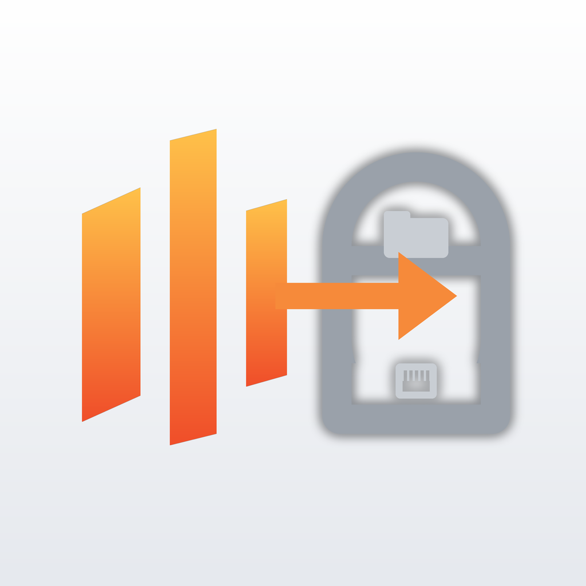

<p align="center">
  
</p>

# unraid-gateway

**One authenticated port that lets a mobile app treat your Unraid shares like a cloud drive.**

`unraid-gateway` is a small Go service that runs as a Docker container on Unraid and exposes:

- a **file API** over the shares you choose: listing, streaming download with `Range`, atomic and *resumable* uploads, move/copy/delete, and a **change feed** designed for the iOS/iPadOS File Provider framework (the thing that makes a provider show up in the Files app next to iCloud Drive);
- a **proxy to the Unraid GraphQL API**, so a companion app can also read array status, shares, Docker containers and notifications without exposing the Unraid WebGUI itself;
- a **small web UI** at `/` to log in with a key, browse and transfer files and try GraphQL queries from any browser.

Everything is authenticated with a regular **Unraid API key** (*Settings → Management Access → API Keys*). The gateway validates the key against Unraid on the LAN, hands the client a short-lived session token, and never stores your Unraid password.

**Per-user access (v0.3):** a client can add an **Unraid username and password** to the API key. The gateway verifies them against Unraid's own SMB service (including a guest check: Samba maps unknown users to guest, so the gateway also opens a share only the real user may open) and then applies exactly the share permissions configured in Unraid (*public / secure / private*, read and write user lists), read from the Samba configuration Unraid generates (`/etc/samba/smb-shares.conf`). Users only see the shares they may read and only write where they may write, like over SMB. `USER_AUTH=required` makes the user mandatory; `off` disables it.

It is the server half of **[Unraid Drive](https://github.com/sidimam/unraid-drive)**, the iPhone/iPad/Vision Pro app whose File Provider extension mounts your shares in the Files app. The gateway is protocol-agnostic and can be used by any HTTP client.

📖 **New here? The complete step-by-step setup guide (container, API key, Cloudflare Tunnel, Cloudflare Access, app) is in the [Unraid Drive wiki](https://github.com/sidimam/unraid-drive/wiki).**

> No Unraid logo is used: the icon is an original design in the Unraid colour palette.

**File ownership.** The container runs as Unraid's `nobody:users` and creates files and folders with Unraid's standard modes (`0777`/`0666`, as Tools › New Permissions), so everything created from the app stays editable for every Unraid user over SMB. Folders created over SSH or by other containers with a restrictive owner/mode make the gateway answer `403 permission denied` with the folder, its owner and mode and the fix (see the wiki, Operations › Troubleshooting).

## Why not SMB / SFTP / WebDAV?

| | SMB | SFTP | WebDAV | unraid-gateway |
|---|---|---|---|---|
| Works from 5G / outside the LAN without VPN | ✗ | port-forward root SSH ✗ | ✓ | ✓ |
| Authenticates with the Unraid API key | ✗ | ✗ | ✗ | ✓ |
| Change feed for File Provider sync | ✗ | ✗ | ✗ | ✓ |
| Resumable uploads | ✗ | ✗ | ✗ | ✓ |
| Also proxies the Unraid GraphQL API | ✗ | ✗ | ✗ | ✓ |
| Needs a container on the server | ✗ | ✗ | ✓ | ✓ |

## Install

- **Unraid — Community Applications**: search for *unraid-gateway* in the Apps tab (listing requested; until it appears, use the template URL below).
- **Unraid — template URL**: Docker › Add Container › Template repositories, add `https://raw.githubusercontent.com/sidimam/unraid-gateway/main/templates/unraid-gateway.xml`.
- **Homebrew (macOS/Linux)**: `brew install sidimam/tap/unraid-gateway` then `brew services start unraid-gateway` — for a Mac or Linux box that has the shares mounted.
- **Docker anywhere**: `ghcr.io/sidimam/unraid-gateway:latest`, see below.

## Quick start (Unraid)

1. **Create an API key** in *Settings → Management Access → API Keys*. A dedicated key for the gateway is recommended.
2. **Install the container.** Until it is listed in Community Apps, add the template URL in *Docker → Add Container → Template repositories*:
   `https://raw.githubusercontent.com/sidimam/unraid-gateway/main/templates/unraid-gateway.xml`
   or run it with the [docker-compose.yml](docker-compose.yml) in this repo.
3. **Map only the shares you want on your phone.** `documents`, `media` and `downloads` are preconfigured in the template; add any other share with *Add another Path* using container path `/data/<name>`. Each one appears as a top-level folder in the Files app. Set *Read Only* for shares you only want to browse. Do not map Time Machine shares: sparsebundles cannot be used on iOS and a stray write corrupts the backup.
4. **Set `UNRAID_URL`** to the LAN address of your WebGUI, e.g. `http://192.168.1.10`. Use the IP, not `localhost` (the container has its own network namespace).
5. **Put TLS in front before exposing it.** iOS refuses self-signed certificates inside extensions. Use Nginx Proxy Manager or SWAG with Let's Encrypt, or Cloudflare Tunnel (no port forward needed, works behind CGNAT). Set `TRUST_PROXY=true` so rate limiting sees real client IPs.

```bash
curl -s https://gw.example.com/healthz
# {"status":"ok","version":"v0.1.0"}
```

## Walkthrough

**Does the key's role limit file access?** No. `VIEWER`, `ADMIN` and the other Unraid roles only affect what the GraphQL proxy may do. Read/write access to files is decided solely by the volume mounts (`rw` / `ro`) and `READ_ONLY`.

**Where does the API key go?** Nowhere in the container. The gateway only *validates* keys against Unraid; every client (the iOS app, the web UI, curl) sends its own key at login and gets a session token back. So there is nothing to configure server-side besides `UNRAID_URL` and the share mounts.

1. **Create a key.** WebGUI: *Settings → Management Access → API Keys → Add*. Or from the Unraid shell (the name may only contain letters, digits and spaces):

   ```bash
   unraid-api apikey --create --name "unraid gateway" --roles VIEWER --json
   ```

   `VIEWER` is enough for the file API. Pick `ADMIN` if you want the GraphQL proxy to be able to manage the server (start/stop containers, etc.).

2. **Open the web UI** at `http://<unraid-ip>:8484/` (the *WebUI* button of the container in the Docker tab), paste the key, connect. You can browse the mounted shares, upload with a progress bar, download, rename, delete, and run GraphQL queries through the proxy. The key is exchanged for a session token kept in the browser tab only.

3. **Or use curl:**

   ```bash
   GW=http://192.168.0.100:8484
   TOKEN=$(curl -s -X POST $GW/api/v1/auth/login -H 'Content-Type: application/json' \
             -d '{"apiKey":"'"$UNRAID_API_KEY"'"}' | jq -r .token)

   curl -s $GW/api/v1/fs/list?path=/ -H "Authorization: Bearer $TOKEN" | jq .
   curl -s -T ./photo.jpg "$GW/api/v1/fs/content?path=/documents/photo.jpg" -H "Authorization: Bearer $TOKEN"
   curl -s -X POST $GW/api/v1/graphql -H "Authorization: Bearer $TOKEN" \
        -d '{"query":"{ array { state } }"}'
   ```

4. **Expose it.** Add a public hostname in your Cloudflare Tunnel (or a proxy host in Nginx Proxy Manager / SWAG) pointing at `http://<unraid-ip>:8484`, set `TRUST_PROXY=true`, and use that HTTPS URL in the app.

## Configuration

| Variable | Default | Description |
|---|---|---|
| `UNRAID_URL` | **required** | LAN URL of the Unraid WebGUI (`http://192.168.1.10`). |
| `UNRAID_INSECURE_TLS` | `false` | Skip certificate verification when `UNRAID_URL` is https with a self-signed cert. |
| `UNRAID_VALIDATE_QUERY` | `query { me { id name roles } }` | GraphQL query used to validate API keys. |
| `DATA_ROOT` | `/data` | Directory exposed by the file API. |
| `READ_ONLY` | `false` | Disable every write operation. |
| `LISTEN_ADDR` | `:8484` | Bind address. |
| `SESSION_TTL` | `12h` | Lifetime of a login token. |
| `MAX_LOGIN_ATTEMPTS` | `5` | Failed logins per IP before lockout. |
| `LOGIN_LOCKOUT` | `15m` | Lockout duration. |
| `TRUST_PROXY` | `false` | Honour `X-Forwarded-For` / `X-Real-IP`. |
| `USER_AUTH` | `optional` | `optional`: clients may add an Unraid username+password and get that user's share permissions; `required`: they must; `off`: API key only. |
| `UNRAID_SMB_ADDR` | host of `UNRAID_URL`:445 | Unraid SMB endpoint used to verify user passwords. |
| `SHARES_CONFIG` | `/unraid-shares/smb-shares.conf` | Unraid share security source: mount `/etc/samba/smb-shares.conf` (read-only) here. A directory of `/boot/config/shares/*.cfg` is accepted too. |
| `UPLOAD_TTL` | `24h` | How long an unfinished resumable upload is kept. |
| `INDEX_DB` | `/config/index.db` | SQLite item index (stable ids, change journal). Mount `/config` to keep it across restarts; `off` disables it. |
| `INDEX_DIR_SCAN` | `5m` | How often directories are checked for changes made outside the gateway (directories only are stat'ed). |
| `INDEX_FULL_SCAN` | `6h` | How often every entry is re-stat'ed. |
| `CHANGES_WALK_LIMIT` | `250000` | Max entries scanned per legacy `/fs/changes` page. |
| `CHANGES_DEADLINE` | `20s` | Max wall time per `/fs/changes` page. |
| `TLS_CERT` / `TLS_KEY` | | Serve HTTPS directly instead of behind a proxy. |
| `LOG_REQUESTS` | `true` | One access line per request on stdout. |
| `LOG_FORMAT` | `text` | `text`: readable, aligned lines (what the Unraid Docker log viewer shows best); `json`: one JSON object per line for log collectors. |
| `LOG_LEVEL` | `info` | `debug`, `info`, `warn`, `error`. |
| `LOG_HEALTHCHECKS` | `false` | Also log `/healthz` probes (Docker hits it every 30 s). |

The container runs as `99:100` (`nobody:users`), so files created through the gateway get the same ownership as files created over SMB.

## API

All endpoints live under `/api/v1`. Responses are JSON unless noted. Errors are `{"error":"..."}` with a meaningful HTTP status.

### Authentication

```http
POST /api/v1/auth/login
{"apiKey":"<unraid api key>"}

200 {"token":"…","expiresAt":"…","identity":{"name":"root","roles":["admin"]},"readOnly":false}
```

Then send `Authorization: Bearer <token>` on every call. For scripts you may instead send `x-api-key: <unraid api key>` directly; the gateway caches validations for five minutes.

`POST /auth/logout`, `GET /auth/session`, `GET /info` are also available.

### Files

| Method | Path | Notes |
|---|---|---|
| `GET` | `/fs/list?path=/Photos&hidden=1` | Entries sorted dirs-first. Returns the directory `etag` too. |
| `GET` | `/fs/stat?path=` | Single entry. |
| `GET`/`HEAD` | `/fs/content?path=&download=1` | Streams the file. Supports `Range`, `If-None-Match`, `If-Range`. |
| `PUT` | `/fs/content?path=&overwrite=false` | Whole-file upload, written to a temp sibling and renamed atomically. `If-Match: <etag>` for optimistic locking, `X-Mtime: RFC3339` to preserve the client mtime. |
| `POST` | `/fs/mkdir` `{"path":"/a/b","parents":true}` | |
| `POST` | `/fs/move` `{"from":"/a","to":"/b","overwrite":false}` | Falls back to copy+delete across devices. |
| `POST` | `/fs/copy` `{"from":"/a","to":"/b"}` | Recursive. |
| `POST` | `/fs/delete` `{"path":"/a","recursive":false}` | Non-empty directory without `recursive` → `409`. |
| `GET` | `/fs/changes?seq=<n>` | **Change journal** (0.5+): every item created, modified, moved or deleted after sequence `n`, with stable ids; instant. |
| `GET` | `/fs/item?id=<id>` | Entry for a stable id (0.5+). |
| `GET` | `/activity` | **Activity** (0.7+): connected devices, streams/transfers in progress with bytes and speed, recent transfers; drives the web UI's Activity panel. |
| `POST` | `/fs/ticket` | **Media ticket** (0.6+): signed, expiring URL `/media/<ticket>` for one file, for players that cannot send headers (mpv on Apple TV, VLC, browsers); Range supported. |
| `GET` | `/fs/changes?path=/&since=<unix ns>&after=&cursor=` | Legacy change feed (mtime walk), paginated, see below. |

Entry shape:

```json
{"name":"IMG_0001.HEIC","path":"/Photos/IMG_0001.HEIC","type":"file","size":2345678,
 "mtime":"2026-09-08T14:03:11.120Z","etag":"\"23cace-1856f2c0a3b1c2d0\"","mode":"-rw-rw-r--"}
```

### Resumable uploads

Designed for large files on flaky mobile links. The temp file lives next to the destination, so commit is an atomic rename on the same filesystem.

```http
POST   /fs/uploads                {"path":"/Video/clip.mov","size":734003200,"overwrite":false}
       → 201 {"id":"…","offset":0,"expiresAt":"…"}
PATCH  /fs/uploads/{id}           Upload-Offset: 0        <bytes…>   → 204, Upload-Offset: 8388608
HEAD   /fs/uploads/{id}           → Upload-Offset: <current>          (resume after a network drop)
POST   /fs/uploads/{id}/commit    X-Mtime: 2026-09-08T14:03:11Z       → 201 <entry>
DELETE /fs/uploads/{id}           → 204                               (abort)
```

A `PATCH` whose `Upload-Offset` does not match the server returns `409` with the correct offset. Unfinished uploads expire after `UPLOAD_TTL`.

### Change feed

**Item index and journal (0.5+).** The gateway keeps a small SQLite catalogue of every file and directory under `/data` (`INDEX_DB`, mount `/config` for it): a stable `id` per item (listings and `stat` carry `id` and `parentId`), and a journal of changes with a growing `seq`. Writes through the API update it immediately; a directory is reconciled whenever a client lists it; a background scanner catches changes made over SMB or by other containers (directory mtimes every `INDEX_DIR_SCAN`, every entry every `INDEX_FULL_SCAN`). Clients then sync like OneDrive or Google Drive: `GET /fs/changes?seq=<last>` returns

```json
{"seq": 4711, "reset": false, "truncated": false,
 "changes": [{"seq": 4709, "kind": "upsert", "id": "…", "path": "/documents/report.pdf", "entry": {…}},
             {"seq": 4710, "kind": "move", "id": "…", "path": "/media/2026", "oldPath": "/media/new", "entry": {…}},
             {"seq": 4711, "kind": "delete", "id": "…", "path": "/downloads/old.iso"}]}
```

`seq=0` (first sync) and a `seq` older than the retained journal (30 days) answer `reset:true`: enumerate again and continue from the returned `seq`. Ids survive renames (in place or through the API), moves, gateway restarts and app reinstalls.

**Legacy feed.** `GET /fs/changes?path=/&since=<cursor>` walks the subtree and returns:

```json
{"cursor":1757340191000000000,
 "dirs":["/Photos/2026","/Documents"],
 "files":[{...},{...}],
 "truncated":true,"next":"/Photos/2026/IMG_0412.HEIC","scanned":62518}
```

- `dirs` are directories whose mtime moved past `since`: something was **added, removed or renamed** inside them. Re-enumerate those.
- `files` are regular files modified after `since`. Refresh their metadata/content.
- **Pagination.** Walking a big share on Unraid's shfs is slow (roughly 3,000 entries per second). A page stops after `CHANGES_WALK_LIMIT` entries or `CHANGES_DEADLINE` and returns `truncated:true` with `next`. Call again with `after=<next>&cursor=<cursor>` and the same `since` to resume exactly where it stopped; entries are never reported twice. Save `cursor` as your new `since` only after a page with `truncated:false`.
- `since=0` is a full scan. The cursor is deliberately two seconds in the past so writes racing the scan are reported again rather than lost.
- Files created by the gateway itself (`*.gwpart`) and dot-files are excluded.
- Writes to a share mounted `:ro` return `403 share is mounted read-only`.

This maps directly onto `NSFileProviderReplicatedExtension`'s enumerator + sync-anchor model without needing inotify on the shfs FUSE mount.

### GraphQL proxy

```http
POST /api/v1/graphql
Authorization: Bearer <token>
{"query":"{ array { state } shares { name free } }"}
```

Forwarded to `UNRAID_URL/graphql` with the session's `x-api-key`. Response is returned verbatim.

## Security model

- The Unraid API key is sent **once** at login over TLS; afterwards only an opaque random session token travels. Sessions live in memory and die with the container.
- Login is rate-limited per client IP with a temporary lockout. Enable `TRUST_PROXY` behind a reverse proxy or the proxy's IP will be what gets locked.
- Every path is confined to `DATA_ROOT`. `..` is clamped, symlinks pointing outside the root are refused.
- Share roots (`/data/<name>`) are mount points: they can be listed and written into, but the API refuses to rename, move, replace or delete them, and nothing can be created directly at the root.
- The container runs unprivileged as `nobody:users`; mount only the shares you need and use `:ro` where writes are not required.
- What the gateway exposes is decided by **volume mounts**, and, when a user logs in, by **Unraid's share security** for that user. The API key's role never affects file access. Passwords are verified by Samba on Unraid over a normal SMB2 session; the gateway does not store them (sessions keep only the resulting permission map).
- No CORS headers are sent, and the embedded UI runs under a strict Content-Security-Policy on the same origin.

## Logs and console

Logs (*Docker → unraid-gateway → Logs*) start with a banner summarising the effective configuration, then one line per event:

```
2026-09-08 20:43:57 INFO  login ok (user)                  user=sdimambro key="unraid gateway" ip=203.0.113.7 shares="documents=rw media=ro"
2026-09-08 20:43:57 WARN  login failed: Unraid rejected the username/password  user=guest ip=203.0.113.7 guest=true
2026-09-08 20:43:57 INFO  PUT    /api/v1/fs/content           → 201 in 42ms  file=/documents/report.pdf  user=sdimambro  ip=203.0.113.7
```

Health-check probes are hidden unless `LOG_HEALTHCHECKS=true`; `LOG_FORMAT=json` switches to machine-readable output.

**Console walkthrough**: the *Console* button of the container (or `docker exec -it unraid-gateway sh`) opens a shell that greets you with a guided status check. The `gw` helper offers: `gw status` (API, Unraid API, mounted shares rw/ro, user-auth prerequisites), `gw shares` (each share's Unraid security and user lists), `gw users`, `gw login <user>` (interactive test login showing the resulting permissions), `gw key`, `gw env`, `gw activity` (who is connected, what is streaming; `-w` live), `gw devices` (registered installations, `rm <id>|all` revokes), `gw notify-test`. The gateway keeps a **device registry** (revoke a lost phone from the web UI), sends **notifications** for new/removed devices (Unraid, SMTP, Telegram) and can **manage Unraid API keys** (list/create/delete/rotate with an ADMIN key). See the wiki page *Devices, notifications and API keys*. The web UI can remember the API key on the gateway (`WEBUI_API_KEY` or the *Remember* checkbox → `/config/webui.key`) for one-click login.

## Development

`scripts/fake_unraid.py` is a tiny stand-in for the Unraid GraphQL endpoint (accepts the API key `good-key` on port 18080), handy to run the container locally: `UNRAID_URL=http://host.docker.internal:18080`.

```bash
go test ./...
go run ./cmd/unraid-gateway   # needs UNRAID_URL, DATA_ROOT
docker build -t unraid-gateway .
```

Images for `linux/amd64` and `linux/arm64` are published to `ghcr.io/sidimam/unraid-gateway` by GitHub Actions on every push to `main` and on `v*` tags.

## Roadmap

- [x] Companion iOS/iPadOS/visionOS app with File Provider extension: [Unraid Drive](https://github.com/sidimam/unraid-drive)
- [ ] Optional per-share permissions bound to Unraid roles
- [ ] Thumbnails endpoint for images/videos
- [ ] Community Apps listing

## License

MIT
